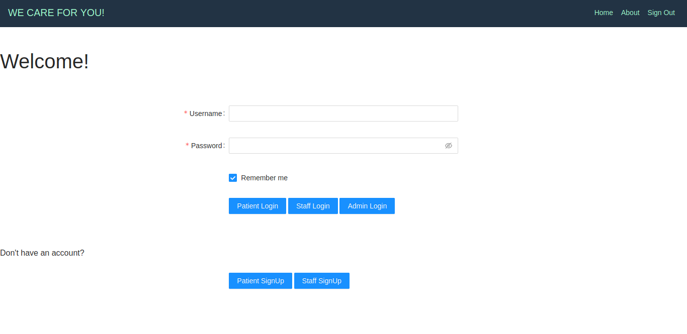
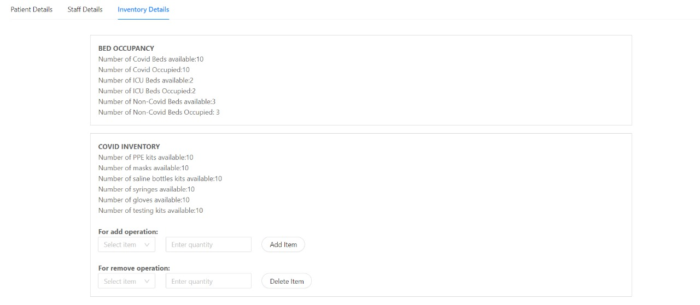
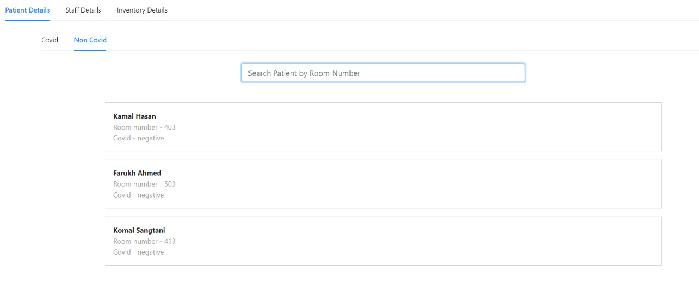
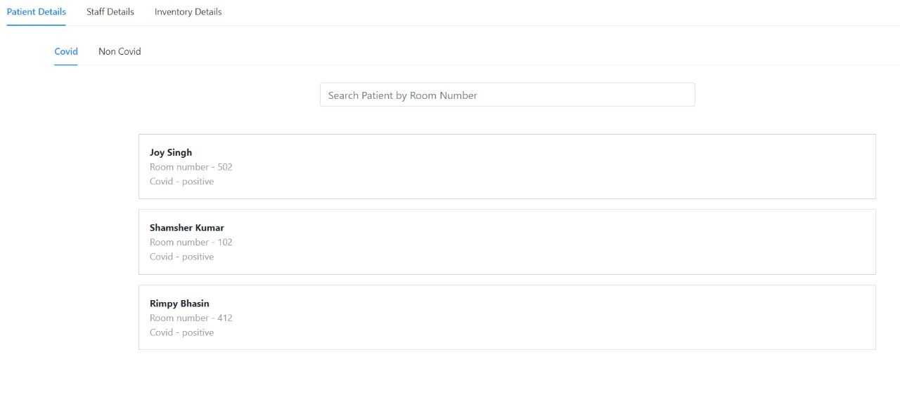
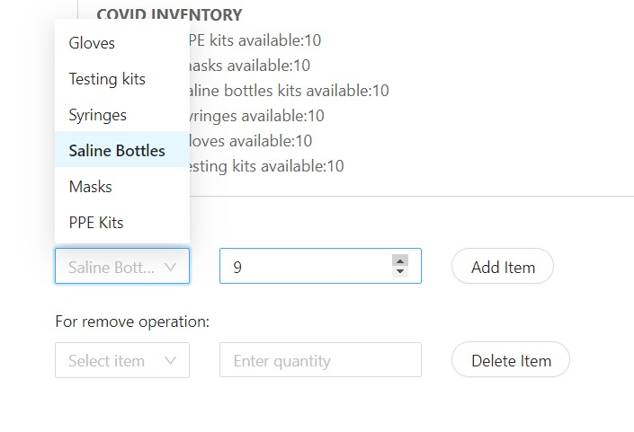

# Hospital Management System
A MERN Stack software to effectively manage Covid-19 patients and handle other hospital operations.

## Table of Contents
1. [Tech Stack Used](#tech-stack)
2. [Set Up and Installation](#installation)
3. [Working On the App](#working-with-the-react-app)
4. [Contact Us](#contact-us)

## Tech Stack
The project mainly focuses on the MERN stack:
1. **MongoDB** <br>
A Document based NoSQL database, which uses JSON type storage known as binary JSON (BSON).
2. **Express** <br>
A Node.js web framework which acts as a middleware for the function of creating robust APIs.
3. **ReactJS**<br>
ReactJS is an open-source JavaScript Library, used in the development of the front end of the web app.
4. **Nodejs**<br>
Node.js is a free, open-sourced JavaScript run-time environment that lets developers write command line tools and server-side scripts outside of a browser.
<p> Additional Dependencies installed :</p>
<ul>
<li>antd
<li>bootstrap
<li>body-parser
<li>ejs
<li>mongoose
<li>nodemon
<li>passport

</ul>

## Installation

1. Installation of all the packages need to be done before hosting the Web App. Execute the following commands:
    1. `mkdir HMS && cd HMS`
    2. `git clone https://github.com/Geet99/Hospital-Management-System.git`
    3. `cd Hospital-Management-System`
    4. `npm install`
    5. `cd backend && npm install`
    6. `node server.js`
    6. Open another terminal
    7. `cd Hospital-Management-System`
    8. `npm start`
    
2. The react app has been hosted on port : 3000 and the server on port : 5000 of our localhost. 
```localhost:3000``` to access the react app

## Working with the React App

1. On accessing the `/` folder, We reach the login page, where we would have multiple logins and sign ups (according to access control).


2. On login as admin, we would have multiple operations

<ul>
<li> Viewing Inventory<br><br>

<li> Patient Filtering<br><br>


<li> Viewing Staff<br><br>

<li> Updating Inventory<br><br>

</ul>

# Contact Us
 Team of 4 for the assignment of Addverb Technologies:
<ul>
<li> Geet Agarwal       : 17ucs059@lnmiit.ac.in
<li> Harshita Nagpal    : 17ucs065@lnmiit.ac.in
<li> Rachna Vivek Tiwari : 17ucs119@lnmiit.ac.in
<li> Rhitayu Chattopadhyay : 17ucs125@lnmiit.ac.in
</ul> 
